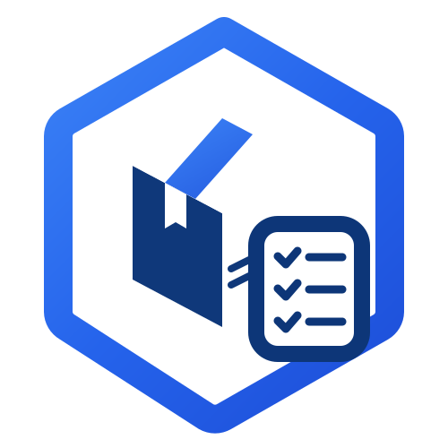

<p align="center">
  
</p>

<h1 align="center">StoreSage</h1>

<p align="center">
  <strong>Smart Multi-Tenant Retail Inventory & Cash Flow Management Platform</strong><br>
  <em>"Kelola Inventaris, Mutasi Stok, dan Buku Kas Toko Lebih Cerdas & Terisolasi"</em>
</p>

<p align="center">
  
  
  
  
  
  
</p>

---

**StoreSage** adalah platform *Software-as-a-Service* (SaaS) modern berbasis web yang dirancang khusus untuk mempermudah pemilik usaha kecil dan menengah (UMKM) serta pengelola ritel dalam mengelola inventaris produk, mutasi stok barang, pencatatan buku kas (arus kas masuk & keluar), serta pemantauan masa aktif langganan toko secara otomatis, aman, dan real-time.

Platform ini mengusung pendekatan **Distraction-Free UX**—antarmuka bersih bertema gelap dengan hierarki kontras yang terukur, visualisasi grafik interaktif, isolasi data antar-toko (*Multi-Tenant Isolation*) yang ketat, serta sistem peringatan masa tenggang otomatis (*H-3 Billing Sentinel*).

---

## 🎯 Core Task & Fungsi Utama Aplikasi

### 1. 📊 Ringkasan Operasional & Valuasi Aset Toko
* **Statistik Real-Time**: Memantau varian produk aktif, total kuantitas unit fisik, jumlah produk stok menipis, dan produk yang habis total.
* **Valuasi Aset Otomatis**: Kalkulasi nilai modal dan nilai pasar total barang di toko secara otomatis (*Stok Fisik × Harga Jual/Modal*).
* **Produk Terlaris Mingguan**: Deteksi otomatis produk dengan volume penjualan tertinggi dalam 7 hari terakhir beserta akumulasi omzetnya.

### 2. 📦 Manajemen Katalog Produk & Peringatan Stok Kritis
* **Spesifikasi Lengkap**: Pencatatan Nama Produk, Kode SKU unik, Harga Modal, Harga Jual, Stok Awal, dan Batas Stok Minimum.
* **Sistem Peringatan Menipis**: Penandaan visual otomatis (kuning untuk menipis, merah untuk habis) saat kuantitas barang menyentuh atau berada di bawah ambang batas minimum.
* **Inline Quick Edit & Search**: Kemudahan mengubah detail harga atau stok secara instan tanpa berpindah halaman, dilengkapi fitur filter pencarian real-time.

### 3. 💵 Pencatatan Buku Kas & Mutasi Stok Terintegrasi
* **Pencatatan Ganda Fleksibel**:
  * **Pemasukan**: Penjualan item produk dari katalog (otomatis memotong stok fisik) atau pendapatan kas operasional lainnya.
  * **Pengeluaran**: Pembelian restok barang ke inventaris (otomatis menambah stok fisik) atau beban biaya operasional toko.
* **Riwayat Mutasi Real-Time**: Log transaksi terstruktur dengan stempel waktu, jenis operasi, jumlah nominal rupiah, dan deskripsi detail.

### 4. 📈 Visualisasi Tren Arus Kas Mingguan
* **Grafik Interaktif Area Chart**: Menampilkan perbandingan dinamis antara arus kas masuk (*Income*) dan kas keluar (*Expense*) selama 7 hari terakhir.
* **Analisis Kesehatan Keuangan**: Membantu pemilik toko melihat profitabilitas dan pergerakan kas secara seketika.

### 5. 🛡️ Billing Sentinel & Notifikasi Masa Aktif (H-3)
* **Peringatan Otomatis H-3**: Banner hitung mundur (hari, jam, menit) otomatis muncul di bagian atas layar ketika sisa masa aktif langganan toko $\le$ 3 hari (72 jam).
* **SaaS Lockdown Enforcement**: Proteksi otomatis yang mengunci akses inventaris dan kasir saat masa aktif telah habis (0 hari), mengarahkan pengguna ke halaman penangguhan dengan panduan perpanjangan resmi.

### 6. 👑 Super Admin & Provisioning Management Console
* **Pendaftaran Tenant Mandiri**: Pembuatan akun toko baru lengkap dengan durasi paket langganan (30 hari, 90 hari, 365 hari, atau Trial).
* **Monitoring Pusat Seluruh Toko**: Dashboard pengawasan status aktif, sisa durasi, dan log antrean toko yang memasuki masa tenggang H-3.
* **Simulator & Kontrol Cepat**:
  * `Demo H-3`: Mensimulasikan sisa masa aktif menjadi $\le$ 3 hari untuk verifikasi banner peringatan.
  * `Demo 5 Menit`: Mengubah masa aktif menjadi 5 menit untuk pengujian alur kedaluwarsa.
  * `Perpanjang +30 Hari`: Menambah masa aktif toko 30 hari secara instan.

---

## 🔒 Arsitektur Keamanan & Isolasi Data

StoreSage menerapkan arsitektur **Multi-Tenant Data Partitioning** berbasis Google Cloud Firestore Security Rules:

```
                          ┌──────────────────────────┐
                          │    Firebase Auth Layer   │
                          │   (Email & Token JWT)    │
                          └────────────┬─────────────┘
                                       │
                    ┌──────────────────┴──────────────────┐
                    ▼                                     ▼
        ┌───────────────────────┐             ┌───────────────────────┐
        │   Role: Super Admin   │             │  Role: Tenant Owner   │
        │ (Akses Pengawasan)    │             │  (Isolasi tenant_id)  │
        └───────────┬───────────┘             └───────────┬───────────┘
                    │                                     │
                    ▼                                     ▼
        ┌───────────────────────┐             ┌───────────────────────┐
        │   Semua Dokumen Toko  │             │   Hanya Dokumen Toko  │
        │      (All Tenants)    │             │  (where tenant_id=id) │
        └───────────────────────┘             └───────────────────────┘
```

* **Tenant Isolation**: Setiap dokumen `products` dan `transactions` terikat dengan atribut `tenant_id`. Pengguna hanya dapat membaca dan menulis data milik tokonya sendiri.
* **Role-Based Access Control (RBAC)**: Pemisahan hak akses antara `super_admin`, `admin` / `tenant_admin` (Pemilik Toko), dan `staff` (Karyawan Operasional).

---

## 🛠️ Teknologi & Ekosistem

| Komponen | Teknologi | Keterangan |
| :--- | :--- | :--- |
| **Frontend Framework** | React 18 (TypeScript) | Komponen deklaratif & type-safety tinggi |
| **Build Tool** | Vite 6 | Kompilasi kilat dan modul HMR efisien |
| **Styling & Theme** | Tailwind CSS 4 | Desain gelap modern & sistem warna harmonis |
| **Database & Auth** | Firebase Firestore & Auth | Database NoSQL real-time & enkripsi akun aman |
| **Visualisasi Data** | Recharts | Grafik area tren arus kas interaktif |
| **Icons & Animasi** | Lucide React & Motion | Ikonografi standar industri & transisi halus |

---

## 🚀 Panduan Memulai & Menjalankan Proyek

### 1. Prasyarat
* **Node.js**: Versi 18.0.0 atau yang lebih baru
* **NPM**: Versi 9.0.0 atau yang lebih baru

### 2. Instalasi Dependensi
Clone repositori dan pasang pustaka yang dibutuhkan:
```bash
# Masuk ke direktori proyek
cd storesage

# Pasang dependensi
npm install
```

### 3. Konfigurasi Lingkungan (`.env`)
Pastikan konfigurasi Firebase telah terpasang pada environment atau file konfigurasi proyek:
```env
# .env.example
VITE_FIREBASE_API_KEY=your_api_key_here
VITE_FIREBASE_AUTH_DOMAIN=your_auth_domain.firebaseapp.com
VITE_FIREBASE_PROJECT_ID=your_project_id
VITE_FIREBASE_STORAGE_BUCKET=your_storage_bucket.appspot.com
VITE_FIREBASE_MESSAGING_SENDER_ID=your_messaging_sender_id
VITE_FIREBASE_APP_ID=your_app_id
```

### 4. Menjalankan Server Pengembangan
```bash
npm run dev
```
Aplikasi akan aktif dan dapat diakses melalui peramban di `http://localhost:3000`.

### 5. Build Produksi
```bash
npm run build
```
Hasil kompilasi siap produksi akan tersedia di direktori `dist/`.

---

## 📁 Struktur Direktori Proyek

```text
storesage/
├── public/
│   ├── favicon.svg          # Favicon resmi
│   └── logo.svg             # Logo visual StoreSage
├── src/
│   ├── components/          # Komponen tampilan antarmuka
│   │   ├── AdminCreateTenantView.tsx  # Panel Super Admin & kontrol durasi
│   │   ├── DashboardView.tsx          # Dashboard ringkasan & logger kas
│   │   ├── ExpirationLockScreen.tsx   # Layar kunci akun saat kedaluwarsa
│   │   ├── ProductsView.tsx           # Manajemen katalog & stok
│   │   ├── StoresView.tsx             # Profil & pengaturan toko
│   │   ├── StoreSageLogo.tsx          # Komponen vektor logo dinamis
│   │   └── SubscriptionWarningBanner.tsx # Banner peringatan H-3
│   ├── firebase.ts          # Inisialisasi Firebase Auth & Firestore
│   ├── types.ts             # Definisi TypeScript interface & types
│   ├── utils.ts             # Utilitas formatting mata uang & tanggal
│   ├── App.tsx              # Komponen root & perutean status autentikasi
│   ├── main.tsx             # Entry point aplikasi
│   └── index.css            # Konfigurasi Tailwind CSS
├── firestore.rules          # Aturan keamanan database multi-tenant
├── package.json             # Manifest dependensi & skrip npm
├── vite.config.ts           # Konfigurasi build Vite
└── README.md                # Dokumentasi proyek
```

---

## 👥 Akun Akses Default (Testing & Simulasi)

| Peran Akun | Email Pengguna | Keterangan Akses |
| :--- | :--- | :--- |
| **Super Admin** | `admin@storesage.com` | Akses penuh pembuatan toko, monitoring seluruh UMKM, dan kontrol durasi |
| **Pemilik Toko (UMKM)** | `owner@storesage.com` | Akses inventaris toko, pencatatan buku kas, dan ringkasan operasional |

---

<p align="center">
  Dibuat dengan dedikasi untuk memajukan efisiensi dan transparansi operasional UMKM Indonesia 🇮🇩<br>
  <strong>© StoreSage SaaS Platform</strong>
</p>
